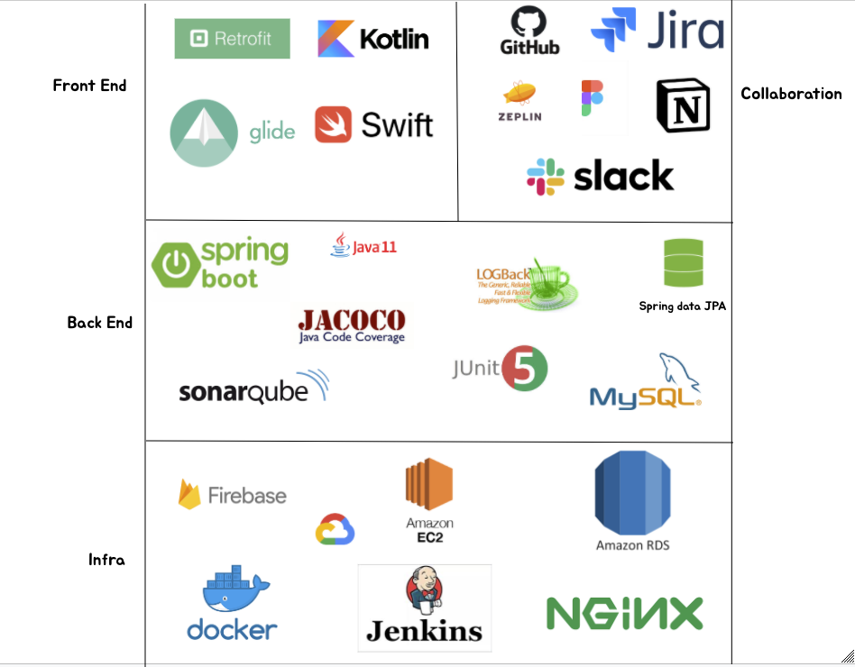
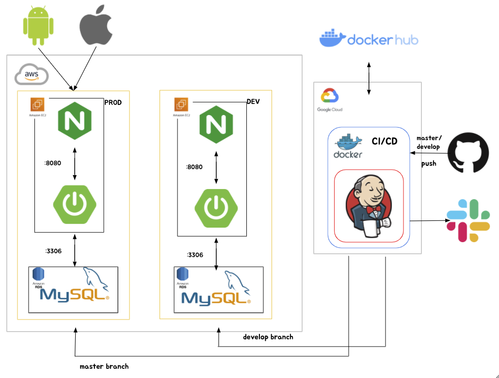
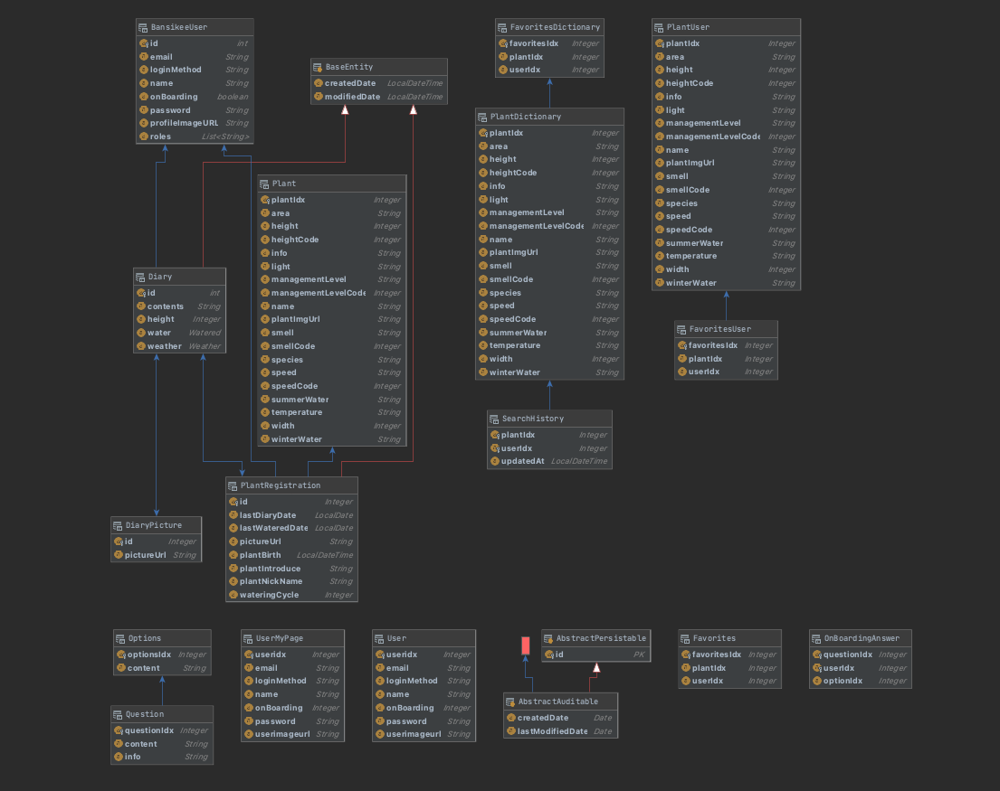

# 반식이 : _반려식물 관리 앱_

## ⛓ 링크
|서비스|노션|데모영상|
|:---|:---|:---|
|[앱스토어](https://play.google.com/store/apps/details?id=com.tomasandfriends.bansikee)|[노션링크](https://www.notion.so/6a15fe6f5f37405d9b930ef9b1b3840a?v=d0d942426e0b426585b4216e3ef48395)|[Youtube](https://www.youtube.com/watch?v=_dU9z03kyFg)|

 
 

## 🌱 반식이란 ?
 "반려식물 👉 반식이"  
 "코로나로 힘든 시기 집에서 식물한번 키워보는건 어떠세요 ? 🪴"  
 "어떤 식물을 키워야 할지 모르겠다면, 반식이에게 추천받아보세요 ! 🔥"  
 "물주는 날짜를 알려주고, 날마다 다이어리를 쓸 수 있어요 ! 📆"
 "식물을 키울 때 필요한 정보도 알려주는 앱, 반식이 🎁"
 
 
## 🛠 기술 스택

## 🖥 배포 자동화 플로우

## 📀 ERD

## 🧑‍💻 토마스와 친구들 팀
|포지션|팀원|
|---|---|
|서버|[김민걸](https://github.com/cmg1411/)|
|서버|이유나|
|IOS|도연서|
|AOS|박태훈|
|디자이너|천세정|
